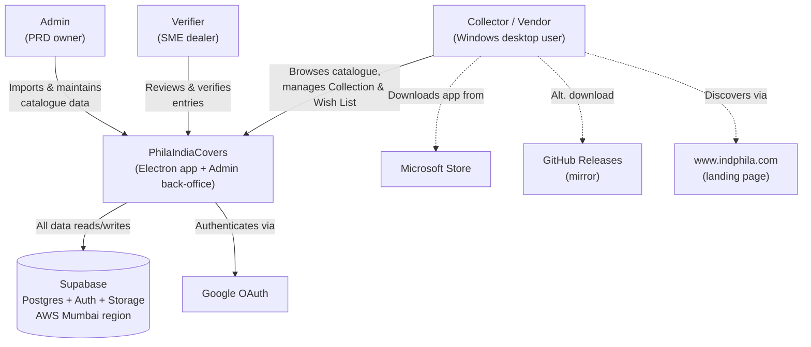
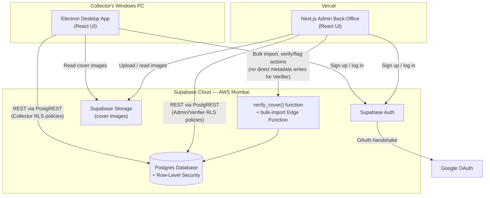
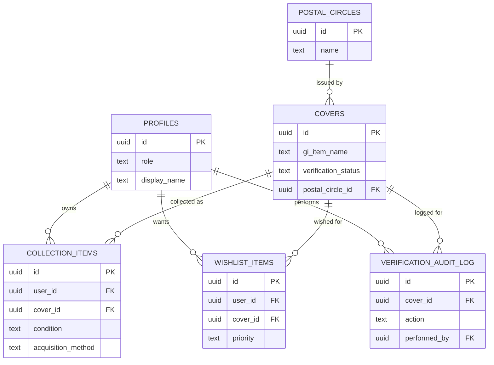
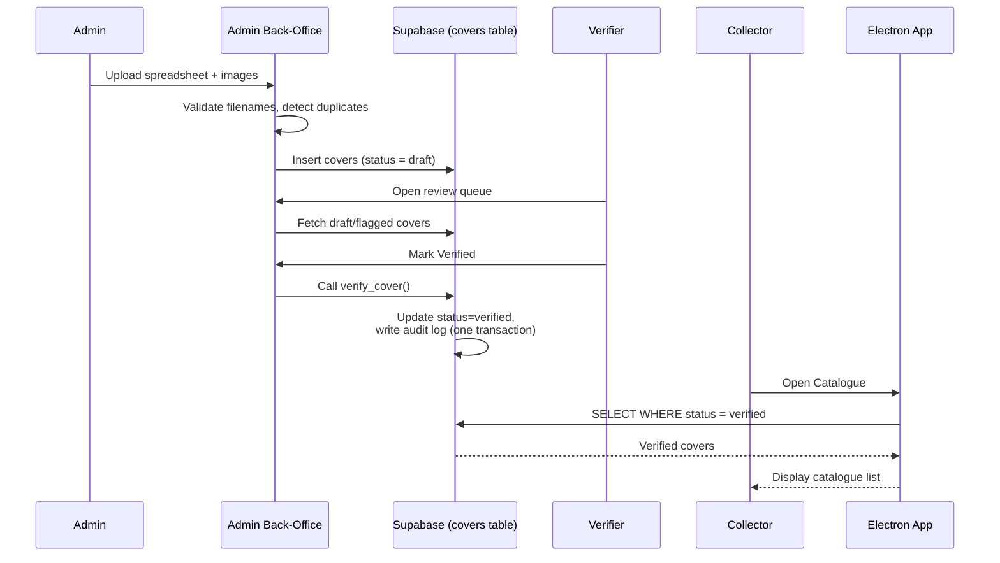
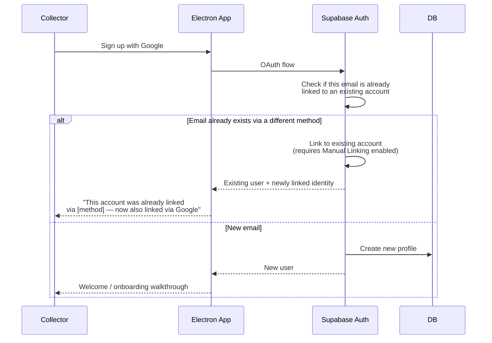
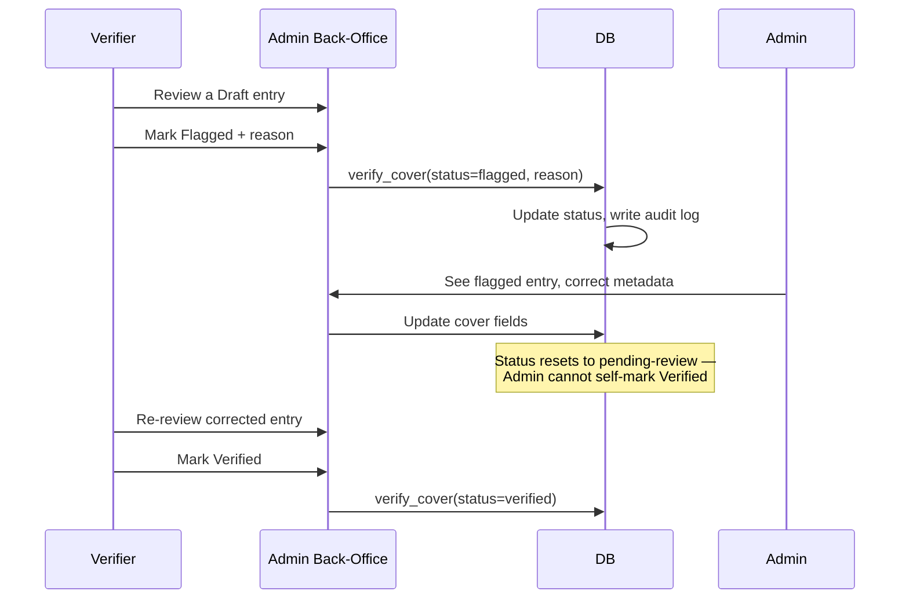
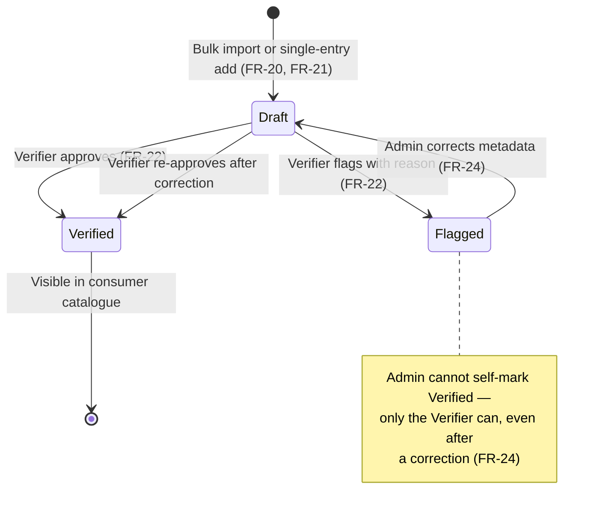
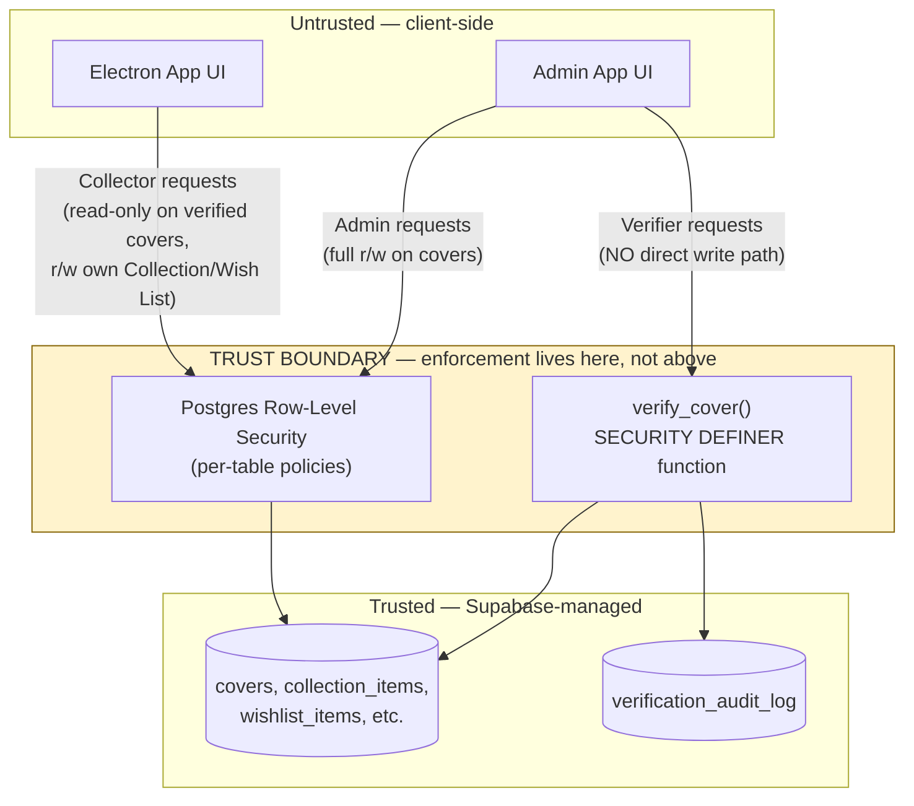

# PhilaIndiaCovers — High-Level Design Document

Covers the system end-to-end: who/what interacts with it, how the pieces are deployed, how data is structured, and how the most important flows actually work. Diagrams use Mermaid syntax — they render automatically if this file is viewed on GitHub, or pasted into any Mermaid-compatible viewer.

> 📚 **Learning note:** §1 and §2 below follow the **C4 model** (Context, Container, Component, Code) — a widely-used way of documenting software architecture at zoomed-in vs. zoomed-out levels, popularized by Simon Brown. Context = the whole system as one black box, showing who/what it talks to. Container = opening that box to see the actual deployable pieces. Component = what's inside each piece. "Code" (the 4th level — class diagrams, function signatures) is what the Low-Level Design document covers instead, kept separate since it changes much faster than the other three. If you haven't seen this model before, it's genuinely worth knowing — it's a common shared vocabulary across the industry, not something specific to this project.

---

## 1. System Context Diagram

Shows PhilaIndiaCovers as a whole system, with everyone and everything it touches from the outside.

**Reading this:** the system itself is a black box here — two apps, one shared backend. The next diagram opens that box up.

---

## 2. Container Diagram

The actual deployable pieces, and how they talk to each other.

**Key design point worth restating here:** the Verifier role has no direct write path to `covers` — every verification action goes through the `verify_cover()` function, which is what actually enforces FR-25's "database-level, not just UI-level" permission boundary.

---

## 3. Component Breakdown (within each container)

**Electron App (consumer):** Auth module · Catalogue module (browse/filter/search/detail) · Collection Manager module · Wish List module · Reports module · Settings/Profile module · Help/Onboarding module.

**Admin Back-Office:** Auth module · Bulk Import module · Cover Editor module · Verification Queue module · Dashboard module (extended with registered-user count and Collection-activation-rate per §3.4).

---

## 4. Data Model (Entity Relationship)

Full column-level detail for every table lives in `PhilaIndiaCovers-API-Integration-Contracts.md` — this is the relationship-level summary.

---

## 5. Key Sequence Diagrams

### 5.1 The Walking Skeleton — bulk import through to a collector seeing a cover

This is deliberately the first thing being built (T-01–T-09), since it proves the riskiest part of the whole system before anything else is layered on top.

### 5.2 Signup with automatic account linking (FR-26/FR-28)

### 5.3 A Verifier flagging an entry, and its correction loop (FR-22–24)

---

## 7. Verification Status — State Diagram

The lifecycle every cover entry moves through, and the only legal transitions between states.

> 📚 **Learning note:** this is a **state machine** (or state diagram) — a formal way of listing every possible state something can be in, and every legal transition between them. The value isn't just visualizing what _can_ happen — it's making the _impossible_ transitions explicit too. Notice there's no arrow from `Flagged` straight to `Verified`: that gap is deliberate and is exactly what stops a bug (or a rushed shortcut) from silently skipping a required review step.

**Why this matters as its own diagram:** the sequence diagrams in §5 show individual flows happening once; this shows the complete, exhaustive set of states a cover can ever be in, and makes it visually obvious that there is no path from `Flagged` directly to `Verified` — every correction must pass back through review. That invariant is easy to accidentally violate in code without a diagram like this making it explicit.

## 8. Security / Trust-Boundary Diagram

Where enforcement actually happens, not just where roles are described.

> 📚 **Learning note:** a "trust boundary" is a standard security-architecture concept — a line in your system past which you stop assuming code is well-behaved. Everything on the client side (an app running on someone else's computer) is, by definition, outside your control: a user could modify requests, bypass UI logic, or run an old/tampered version of the app. The rule of thumb this diagram illustrates: **real enforcement always lives on the server/database side of that line, never the client side.** A button that's simply hidden in the UI is not a security control — it's a suggestion.

**The one sentence that matters most in this whole document:** anything above the trust boundary (both UIs) must be assumed hostile or buggy — a UI-only permission check is not security, it's a convenience. Every real guarantee in this system (a Verifier truly cannot edit metadata, a Collector truly cannot see another collector's Wish List) is enforced inside the shaded boundary, in Postgres itself, not in React code above it.

## 9. Deployment View

| Piece                             | Runs where                                                                                                               |
| --------------------------------- | ------------------------------------------------------------------------------------------------------------------------ |
| Electron consumer app             | Installed locally on each collector's Windows PC, distributed via Microsoft Store (primary) and GitHub Releases (mirror) |
| Next.js admin back-office         | Vercel (free tier)                                                                                                       |
| Backend (Postgres, Auth, Storage) | Supabase Cloud, AWS Mumbai region — separate Free (dev) and Pro (production) projects                                    |
| Landing page                      | www.indphila.com (third-party domain, PRD owner has direct publishing access)                                            |

---

_This document is a companion to the main PRD (`PhilaIndiaCovers-PRD-v1.0.md`) and the detailed schema in `PhilaIndiaCovers-API-Integration-Contracts.md` — it's the visual/architectural view of the same locked decisions, not a new source of requirements._
